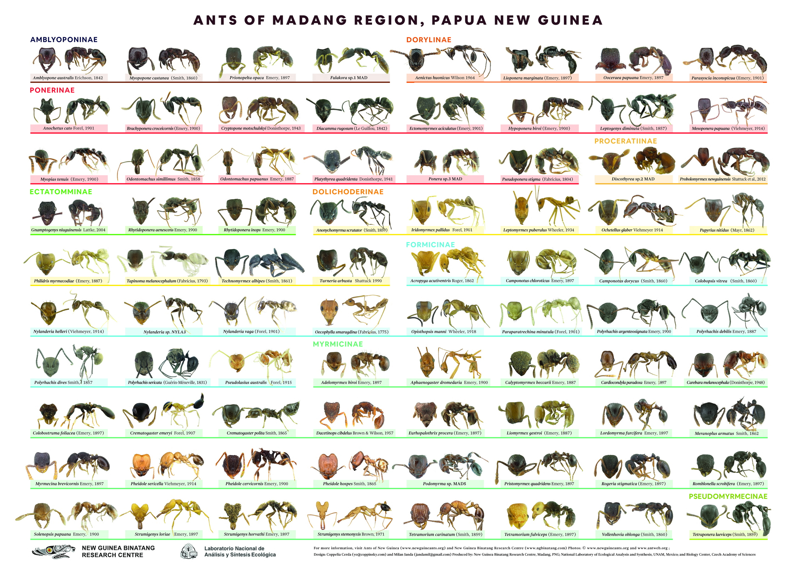
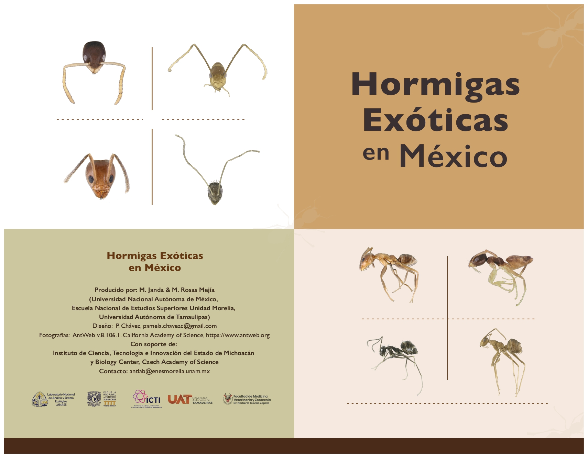
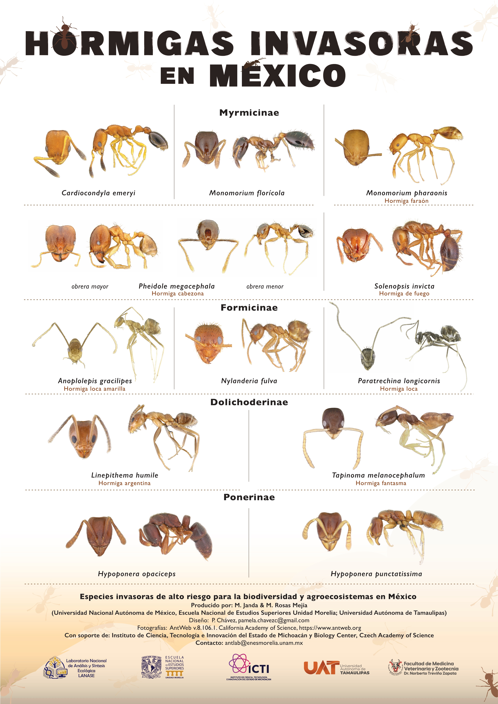

<h1>Ant Posters</h1>  

Educational posters faturing ants from various regions of Melanesia and Mexico. The posters are free to download and use for educational and research purposes. For high resolution versions, contact us.



<article>
  

    <h4>Ants of Madang Region, Papua New Guinea</h4>
  
Representatives of the 80 ant species and the main genera from northeast Papua New Guinea.

    
  <a href="../images/Ants_Madang_final_reduced_s1 (1).pdf" target="_blank" rel="noopener noreferrer" >Download in high resolution</a>
  

   

    <h4>Ants of Kagalalo, Bougainville</h4>
  
Representatives of the 80 ant species and the main genera from northeast Papua New Guinea.

 
 <a href="../images/Ants_Of_BG_Kagalalo.pdf" target="_blank" rel="noopener noreferrer">Download in high resolution</a>
  

   

    <h4>Ants of Kainake, Bougainville</h4>
  
Poster of common species from Kainake Conservation Area in lowland south Bougainville.

<a href="../images/Ants_Of_BG_Kainake.pdf" target="_blank" rel="noopener noreferrer">Download in high resolution</a>
  

   

   <h4>Ants of Mt. Balbi, Bougainville</h4>
  
Poster of common as well as endemic species from Mt. Balbi region in central Bougainville. 

 
 <a href="../images/Ants_Of_BG_Mt.Balbi.pdf" target="_blank" rel="noopener noreferrer">Download in high resolution</a>
  

   

<h4>Introduced Ants in Papua New Guinea</h4>  

Poster of most important alien ants in Papua New Guinea. 

  
  <a href="../images/EX_1012_Poster.pdf" target="_blank" rel="noopener noreferrer">Download in high resolution</a>
  
  

  

<h4>Exotic ants in Mexico (in Spanish)</h4>  

Leaflet of exotic ants in Mexico 

  
  <a href="../images/leaflet_hormigas_exoticas_MX_full.pdf" target="_blank" rel="noopener noreferrer">Download in high resolution</a>
  
  

  

<h4>Introduced Ants in Mexico (in Spanish)</h4>  

Poster of different species of introduced ants in Mexico 

  
  <a href="../images/poster_hormigas_invasoras_MX_A2.pdf" target="_blank" rel="noopener noreferrer">Download in high resolution</a>
  
  

  <h4>Ants from the Kikori delta to Southern Highlands, Papua New Guinea</h4>  

Poster of different species from Papua New Guinea's Kikori delta 

  
  <a href="../images/ants_kikori.pdf" target="_blank" rel="noopener noreferrer">Download in high resolution</a>
  
  
  
</article>

